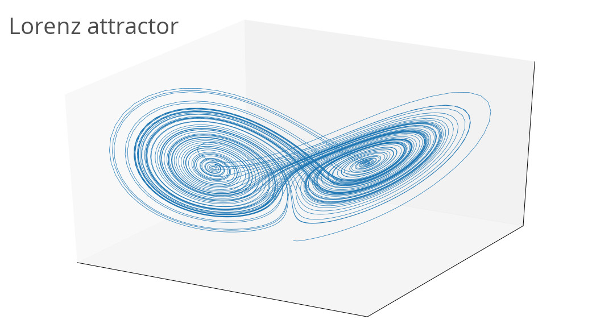

## Bash Bomb:
:() – Defined the function called :. The fork() bomb is defined as follows:
```Bash
   :(){
    :|:&
    };:
```
<span style="color:red"> :|: </span> -  Next it will call itself using programming technique called recursion and pipes the output to another call of the function ‘:’. The worst part is function get called two times to bomb your system.<br>

<span style="color:red"> & </span> - Puts the function call in the background so child cannot die at all and start eating system resources.<br>

<span style="color:red"> ; </span> - Terminate the function definition.<br>

<span style="color:red"> : </span> - Call (run) the function.



## Lorenz Atractor

```python
import numpy as np
import matplotlib.pyplot as plt

def lorenz(x, y, z, s=10, r=28, b=2.667):
    '''
    Given:
       x, y, z: a point of interest in three dimensional space
       s, r, b: parameters defining the lorenz attractor
    Returns:
       x_dot, y_dot, z_dot: values of the lorenz attractor's partial
           derivatives at the point x, y, z
    '''
    x_dot = s*(y - x)
    y_dot = r*x - y - x*z
    z_dot = x*y - b*z
    return x_dot, y_dot, z_dot


dt = 0.01
num_steps = 10000

# Need one more for the initial values
xs = np.empty(num_steps + 1)
ys = np.empty(num_steps + 1)
zs = np.empty(num_steps + 1)

# Set initial values
xs[0], ys[0], zs[0] = (0., 1., 1.05)

# Step through "time", calculating the partial derivatives at the current point
# and using them to estimate the next point
for i in range(num_steps):
    x_dot, y_dot, z_dot = lorenz(xs[i], ys[i], zs[i])
    xs[i + 1] = xs[i] + (x_dot * dt)
    ys[i + 1] = ys[i] + (y_dot * dt)
    zs[i + 1] = zs[i] + (z_dot * dt)


# Plot
fig = plt.figure(figsize=(15, 8.8))
ax = fig.gca(projection='3d')
ax.plot(xs, ys, zs, lw=0.6)
ax.set_xticks([])
ax.set_yticks([])
ax.set_zticks([])
ax.set_title("Lorenz Attractor", size="18", pad = "20")
plt.show()
```
